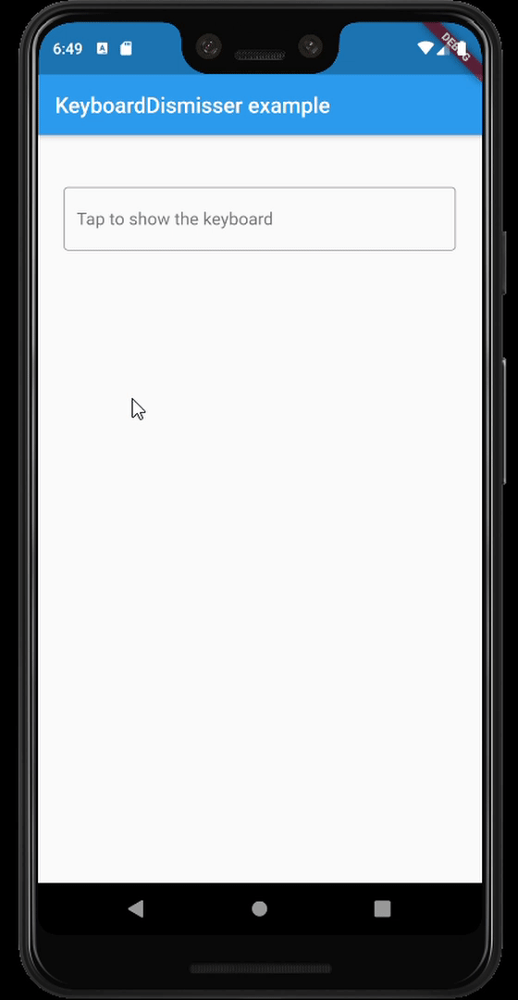

# keyboard_dismisser

A simple Flutter package to hide the keyboard when performing a gesture outside of it.

[](https://pub.dartlang.org/packages/keyboard_dismisser)



## Features

* By default, dismisses the keyboard when tapping outside of it on an inactive widget.
* Supports several gestures at the same time.
* Supports all the gestures available in Flutter's `GestureDetector`.
* Supports directional swipes to dismiss the keyboard.
* Can be applied to a whole page by wrapping its Scaffold.
* Can be applied to a whole app, by wrapping its MaterialApp, WidgetsApp, or CupertinoApp.
* Customizable drag start behavior and gesture hit testing behavior.
* Can be excluded from the semantics tree.

## Usage

This package exposes a `KeyboardDismisser` stateless widget. You can wrap your widget with it, and
your widget will be able to dismiss the keyboard when performing a gesture.

```dart
    Widget build(BuildContext context) => KeyboardDismisser(
        child: Scaffold(
            body: ...,
        ),
      );
```

`KeyboardDismisser` takes a `gestures` parameter, which is a list of `GestureType` enum cases. This
way, you can pass any gesture you like for the keyboard dismissal. By default, `KeyboardDismisser`
will dismiss the keyboard when tapping outside of it, but it handles several gestures at the 
same time.

```dart
    Widget build(BuildContext context) => KeyboardDismisser(
        gestures: [GestureType.onTap, GestureType.onPanUpdateDownDirection],
        child: Scaffold(
            body: ...,
        ),
      );
```

## Getting started

In the `pubspec.yaml` of your flutter project, add the following dependency:

```yaml
dependencies:
  keyboard_dismisser: "^1.0.0"
```

Then run `$ flutter pub get`. In your library, add the following import:

```dart
import 'package:keyboard_dismisser/keyboard_dismisser.dart';
```

## Author

Diego Rogel - [GitHub](https://github.com/drogel)

## Changelog

Check the [Changelog](./CHANGELOG.md) page to see what's recently changed.

## License

This project is licensed under the MIT License - see the [LICENSE](LICENSE) file for details.